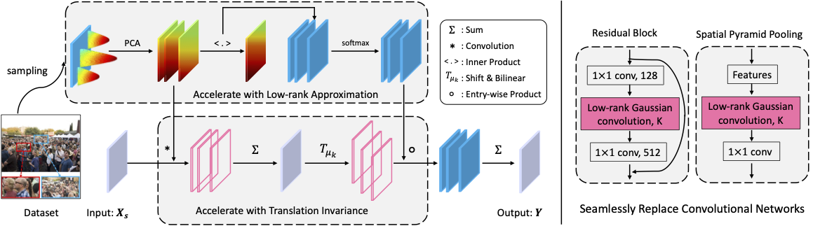

# Rethinking Spatial Invariance of Convolutional Networks for Object Counting (CVPR 2022)

## 2022 Pulitzer Prize for public service
Our method was applied to the analysis of Capitol Riot by the Washington Post and won the [**2022 Pulitzer Prize for public service**](https://www.pulitzer.org/prize-winners-by-year). Please visit [YouTube](https://www.youtube.com/watch?v=WiZ51V5M0C8&ab_channel=Zhi-QiCheng) to watch the video demonstration and 
[Washington Post](https://www.washingtonpost.com/investigations/interactive/2021/dc-police-records-capitol-riot/) for original news reports.

## Introduction
This is the implementation of the paper: [**Rethinking Spatial Invariance of Convolutional Networks for Object Counting**](https://arxiv.org/pdf/2206.05253.pdf). This repository is a self-contained GauNet implementation in C++ and CUDA, plus a TensorFlow plugin. Use this library to implement DAU layers for any deep learning framework.

Inspired by previous work, we propose a low-rank approximation accompanied with translation invariance to favorably implement the approximation of massive Gaussian convolution. We try to use locally connected Gaussian kernels to replace the original convolution filter to estimate the spatial position in the density map. The purpose of this is to allow the feature extraction process to potentially stimulate the density map generation process to overcome the annotation noise. Our work points a new direction for follow-up research, which should investigate how to properly relax the overly strict pixel-level spatial invariance for object counting.



## Available implementations
The TensorFlow implementation relies on the [DAU-ConvNet](https://github.com/skokec/DAU-ConvNet) repositories, and we are actively preparing to add new PyTorch implementations. There are some inconsistencies in the function of the current TensorFlow version. Suggest waiting for our PyTorch implementation.
- [x] TensorFlow version
- [-] PyTorch vsrsion 

See below for more details on each implementation.


## TensorFlow
We provide TensorFlow plugin and appropriate Python wrappers that can be used to directly replace the `tf.contrib.layers.conv2d` function. Note our C++/CUDA code natively supports only NCHW format for input. Please update your TensorFlow models to use this format. 

Requirements and dependency libraries for TensorFlow plugin:
 * Python (tested on Python2.7 and Python3.5)
 * TensorFlow 1.6 or newer 
 * Numpy
 * OpenBlas
 * (optional) Scipy, matplotlib and python-tk  for running unit test in `dau_conv_test.py`
 
## Installation from pre-compiled binaries (pip)
If you are using `TensorFlow` from pip, then install pre-compiled binaries (.whl) from the [RELEASE](https://github.com/skokec/DAU-ConvNet/releases) page (mirror server also available http://box.vicos.si/skokec/dau-convnet):

```bash
# install dependency library (OpenBLAS)
sudo apt-get install libopenblas-dev  wget

# install dau-conv package
export TF_VERSION=1.13.1
sudo pip install https://github.com/skokec/DAU-ConvNet/releases/download/v1.0/dau_conv-1.0_TF[TF_VERSION]-cp35-cp35m-manylinux1_x86_64.whl
```

Note that pip packages were compiled against the specific version of TensorFlow from pip, which must be installed beforehand.

## Docker 
Pre-compiled docker images for TensorFlow are also available on [Docker Hub](https://hub.docker.com/r/skokec/dau-convnet) that are build using the [`plugins/tensorflow/docker/Dockerfile`](https://github.com/skokec/DAU-ConvNet/blob/master/plugins/tensorflow/docker/Dockerfile). 

Dockers are build for specific python and TensorFlow version. Start docker, for instance, for Python3.5 and TensorFlow r1.13.1, using:

```bash
sudo nvidia-docker run -i -d -t skokec/tf-dau-convnet:1.0-py3.5-tf1.13.1 /bin/bash
```

## Build and installation ##
Requirements and dependency libraries to compile DAU-ConvNet:
 * Ubuntu 16.04 (not tested on other OS and other versions)
 * C++11
 * CMake 2.8 or newer (tested on version 3.5)
 * CUDA SDK Toolkit (tested on version 8.0 and 9.0)
 * BLAS (ATLAS or OpenBLAS)
 * cuBlas

On Ubuntu 16.04 with pre-installed CUDA and cuBLAS (e.g. using nvidia/cuda:9.0-cudnn7-devel-ubuntu16.04 or nvidia/cuda:8.0-cudnn5-devel-ubuntu16.04 docker) install dependencies first:

```bash
apt-get update
apt-get install cmake python python-pip libopenblas-dev
 
pip install tensorflow-gpu>=1.6
# Note: during installation TensorFlow package is sufficient, but during running, the TensorFlow-GPU is required.
```

Then clone the repository and build from the source:
```bash
git clone https://github.com/skokec/DAU-ConvNet
git submodule update --init --recursive

mkdir DAU-ConvNet/build
cd DAU-ConvNet/build

cmake -DBLAS=Open -DBUILD_TENSORFLOW_PLUGIN=on ..

make -j # creates whl file in build/plugin/TensorFlow/wheelhouse
make install # will install whl package (with .so files) into python dist-packages folder 

```

## Preparation 
- Clone this repo in the directory (```Root/GauNet```):
- Install dependencies. We use python 3.7 and PyTorch >= 1.6.0 : http://pytorch.org.

    ```bash
    conda create -n GauNet python=3.7
    conda activate GauNet
    conda install pytorch==1.7.0 torchvision==0.8.0 cudatoolkit=10.2 -c pytorch
    cd ${GauNet}
    ```

## Training
Check some parameters in ```config.py``` before training,
Please refer to [C^3 Framework](https://github.com/gjy3035/C-3-Framework).

## Testing
Please refer to [C^3 Framework](https://github.com/gjy3035/C-3-Framework).

## Acknowledgment
We thank Vitjan Zavrtanik (VitjanZ) for TensorFlow C++/Python wrapper.
The released training script borrows some codes from the [C^3 Framework](https://github.com/gjy3035/C-3-Framework) and [DAU-ConvNet](https://github.com/skokec/DAU-ConvNet) repositories. If you think this repo is helpful for your research, please consider citing them. 

## Citation
Please cite our CVPR 2022 paper when using GauNet code:
```
@InProceedings{Cheng_2022_CVPR,
    author    = {Cheng, Zhi-Qi and Dai, Qi and Li, Hong and Song, Jingkuan and Wu, Xiao and Hauptmann, Alexander G.},
    title     = {Rethinking Spatial Invariance of Convolutional Networks for Object Counting},
    booktitle = {Proceedings of the IEEE/CVF Conference on Computer Vision and Pattern Recognition (CVPR)},
    month     = {June},
    year      = {2022},
    pages     = {19638-19648}
}
```
